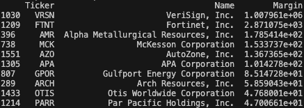

# Stock Valuation Project 
First prototype.
## Overview

This project provides tools designed to facilitate the identification and shortlisting of undervalued stocks listed on Yahoo Finance. Utilizing comprehensive financial data accessed through the Yahoo Finance API, this tool aims to pinpoint stocks that are significantly undervalued with high potential for growth, thereby assisting investors in making informed long-term investment decisions.

## Features

The Stock Valuation Project offers a range of features designed to aid investors in identifying undervalued investment opportunities across various sectors and markets:

- **Stock Analysis**: Identifies and lists the \( n \) most undervalued stocks by evaluating their financial health and stock valuation, facilitating a comparative analysis across different sectors and markets.
- **Customizable Filters**: Allows users to refine their search by applying filters based on country, sector, and market capitalization range, tailoring the analysis to specific investment interests or strategies.
- **Yearly Updates**: Automatically fetches updated financial data for any publicly traded company listed on Yahoo Finance, ensuring the analysis is based on the most recent information.

These features are designed to provide a robust toolset for investors looking to maximize their investment returns by targeting stocks that are likely to be undervalued.

## Current Stock Recommendations (as of May 2024)

Below is an image showcasing the latest stock recommendations from our valuation model. This table lists the most undervalued stocks as identified by our system, providing their ticker symbols, company names, and the calculated margin values which suggest their potential for growth:



### Recommendations Table Explained

- **Ticker**: Stock symbol used to identify the company on stock exchanges.
- **Name**: Official name of the company.
- **Margin**: Represents the margin by which our model predicts the stock is undervalued. Higher values suggest greater undervaluation, indicating potential investment opportunities.

## Performance Test Result
The simulation involved selecting and investing in top 10 recommended stocks based on our model's predictions with the default values chosen, tracking their performance over the course of one year.
| Period                    | Return on Stocks | Benchmark Increase (S&P 500) |
|---------------------------|------------------|--------------------|
| 24 May 2023 - 23 May 2024 | 49.15%           | 28.96%             |
| 24 May 2022 - 24 May 2023 | 10.25%           | 4.41%              |

Even though I will need to test with more historical data, the result is promising and highlights its potential to generate actionable insights that can outperform the market.

## Usage
### Tips!
This tool is designed for both seasoned investors and those new to stock investments. 
- For investment enthusiasts, it provides a shortlist of stocks that demonstrate financial health and high growth potential. 
- If you are less experienced or prefer a more hands-off approach, it's recommended to run the tool annually to review and potentially adjust your portfolio based on the top 10 recommended stocks to buy, keep, or sell. These recommendations aim to offer a high margin compared to their current market capitalization.


### Setup and Installation

Before running the application, install the necessary dependencies:

```bash
pip install -r requirements.txt
```

### Running the Application
To start the application and view the list of potentially most undervalued stocks, execute:
```bash
python main.py
```
Follow the prompts on the terminal. To proceed with the recommended actions with default values, simply press Enter at each prompt.

### Updating the Data
To ensure the data is current, you should update it annually. Run the following command to fetch the latest data:

```bash
python update.py
```
Note: Updating the data may take several hours depending on your internet speed and the amount of data being processed.

## Valuation Formula

The valuation formula calculates the **Final Fair Value** of a company's stock as follows:

$$
\text{Final Fair Value} = \frac{(\text{Net Income}) \times (1 + \text{ROIC})^n}{(1 + \text{Base Multiplier})^n} \times \left(\frac{100}{\text{Base Multiplier}}\right) + \text{Current Assets} - \text{Liabilities}
$$

**Final Fair Value**: Qualitative market value of a company under current economic conditions, calculated based on the assumptions that:
- The company will continue to generate returns at the expected growth rate (ROIC) for the next \( n \) years.
- The investor's required return, represented by the base_multiplier (%), reflects the opportunity cost of capital, which is 10% by default.

### Rationale

The formula incorporates a base multiplier of 10%, which is determined based on the opportunity cost of capital, associated investment risks, and prevailing market conditions. This rate is chosen in consideration of alternative investments, specifically more stable bonds, which typically return approximately 5% annually.

#### Analysis of Earning Yield

Earning Yield is a direct measure of the return on investment that investors receive from a company's earnings relative to its share price. It is inversely proportional to the P/E ratio and is calculated as follows:

$$
\text{Earning Yield} = \frac{\text{Earnings for a 12-month period per share}}{\text{Price per share}}
$$

Thus, the relationship between net income and share price can be expressed as:

$$
\text{Net Income} \times (\text{P/E ratio}) = \text{Price per share}
$$

Assuming a company maintains a constant and permanent earning yield of 10%, the price of the company's shares can be estimated by multiplying the net income by 10 (the P/E ratio for a 10% yield). This benchmark sets a standard against which adjustments can be made based on expected growth.

And now, when the expected growth rate became different from 10%, the P/E ratio is adjusted to reflect anticipated returns, allowing for higher valuations in the context of higher expected growth rates.

$$
\text{Net Income} \times \frac{(1 + \text{ROIC})^n}{(1 + \text{Base Multiplier})^n} \times \left(\frac{100}{\text{Base Multiplier}}\right)
$$

This component of my valuation model adjusts the P/E ratio to reflect the expected growth from the company's return on invested capital (ROIC) over the next n years. It does this by factoring in the ROIC's compounding effect over time, which is moderated by the expected rate of return (represented by the base multiplier). This adjustment ensures that the P/E ratio aligns with market valuation standards, offering a realistic projection of the company’s growth potential.

This valuation approach enables investors to estimate the fair value of a company by integrating expected profitability, growth potential, and required returns in a coherent framework. It provides a strategic tool for assessing whether a company's current market valuation aligns with its financial performance and investor expectations.

### Assumptions

The valuation model is predicated on several key assumptions:

- **Investment in Value**: It is assumed that the intrinsic value of a company, reflected by its potential for growth as measured by the Return on Invested Capital (ROIC), will eventually be recognized in the stock price. Although a company may initially reinvest its income for internal growth, it is anticipated that they will undertake share buybacks as a strategic investment, recognizing the value this brings to the company.
- **Market Capitalization Alignment**: Over time, the market is expected to recognize the true value of a company, aligning the market capitalization with the fair value derived from financial analyses.

### Further Improvement

#### Enhancing Growth Rate Predictions:

The current model estimates expected growth rates based on the average of the two most recent ROIC figures. This approach has room for refinement:

- **Volatility Consideration**: If ROIC exhibits significant volatility, there should be a corresponding decrease in the confidence level assigned to the projected growth rates.
- **Weighted ROIC Averaging**: In scenarios where ROIC has increased sharply in recent years, a weighted average may be applied. This would assign lesser weight to recent surges in growth, with adjustments for companies having higher market capitalizations to reflect more conservative growth expectations.

#### Industry Variation in Recommendations:

- To mitigate risk and enhance portfolio diversification, recommendations should consider industry variations. This would involve selecting stocks from different sectors to hedge against sector-specific risks and market volatility.

These improvements aim to refine the valuation model, making it more robust against market anomalies and reflective of realistic, sustainable growth expectations. This iterative refinement process is crucial for maintaining the model’s relevance and effectiveness in a dynamic market environment.

